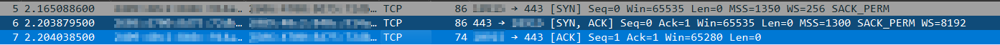
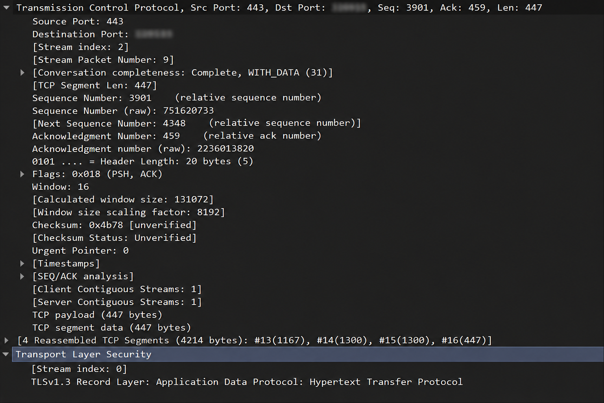

# Lab 01 — TCP Three-Way Handshake & HTTPS Traffic Analysis

## Objective

Capture and analyze a TCP connection using Wireshark and understand how network communication progresses from DNS resolution to TCP connection establishment and encrypted HTTPS communication.

The lab focused on:

- Identifying DNS queries and responses
- Capturing the TCP three-way handshake
- Understanding TCP sequence and acknowledgement numbers
- Identifying TCP flags
- Observing TLS 1.3 negotiation
- Understanding encrypted application data
- Observing TCP segmentation and reassembly

---

## Environment

| Component | Details |
|---|---|
| Operating System | Windows |
| Packet Analyzer | Wireshark 4.6.7 |
| Network Interface | Wi-Fi |
| Local IP | `<CLIENT_IP>` |
| Destination | `example.com` |
| Transport Protocol | TCP |
| Destination Port | `443` |
| Application Protocol | HTTPS |
| TLS Version | TLS 1.3 |

> **Privacy note:** Real local IP addresses, MAC addresses, private hostnames, usernames, machine identifiers, and other environment-specific identifiers have been removed from this write-up. Packet values that are useful for demonstrating the concepts are represented generically where appropriate.

---

# 1. Initial Packet Capture with ICMP

Before analyzing TCP, a simple ICMP capture was performed using:

```powershell
ping 8.8.8.8
```

The Wireshark capture was filtered using:

```text
icmp
```

The capture contained 8 ICMP packets, corresponding to 4 echo requests and 4 echo replies.

### Observations

- Source IP: `<CLIENT_IP>`
- Destination IP: `8.8.8.8`
- Protocol: ICMP
- ICMP Echo Request packets were observed.
- ICMP Echo Reply packets were observed.

This provided a simple introduction to packet capture and filtering before moving to TCP.

---

# 2. Generating TCP Traffic

A new capture was started on the Wi-Fi interface.

TCP traffic was generated using:

```powershell
curl.exe https://example.com
```

The use of `curl.exe` rather than `curl` was intentional because PowerShell can interpret `curl` as an alias for `Invoke-WebRequest`.

---

# 3. DNS Resolution

Before establishing the TCP connection, the system resolved `example.com`.

Wireshark showed a DNS query:

```text
AAAA example.com
```

The DNS response returned an IPv6 address for `example.com`.

The actual address observed during the capture has been intentionally omitted from this public write-up.

This demonstrated that DNS resolution occurs before the client establishes the TCP connection to the destination.

The observed sequence was:

```text
DNS Query
    ↓
DNS Response
    ↓
TCP Connection
```

---

# 4. TCP Three-Way Handshake

The TCP connection to port `443` was identified in Wireshark.

The three packets were:

```text
Client → Server    SYN
Server → Client    SYN, ACK
Client → Server    ACK
```

Port `443` is associated with HTTPS.

---

## 4.1 SYN

The first packet was sent by the client.

The observed packet contained:

```text
Source Port:       <EPHEMERAL_PORT>
Destination Port:  443
Sequence Number:   0 (relative)
Acknowledgement:   0
Flags:             SYN
TCP Segment Length: 0
```

The SYN flag indicates that the client is attempting to establish a TCP connection.

Wireshark displayed a relative sequence number of `0`.

The actual raw sequence number has been intentionally omitted from this public write-up.

### Why is the acknowledgement number 0?

This is the first packet in the connection, so the client has not yet received a sequence number from the server to acknowledge.

---

# 5. SYN-ACK

The server responded with a SYN-ACK packet.

The observed packet contained:

```text
Source Port:       443
Destination Port:  <EPHEMERAL_PORT>
Sequence Number:   0 (relative)
Acknowledgement:   1
Flags:             SYN, ACK
TCP Segment Length: 0
```

The server's SYN establishes its own sequence-number space.

The acknowledgement number is `1` because the client's SYN consumes one sequence number.

Conceptually:

```text
Client:
SYN
Seq = 0

Server:
SYN + ACK
Seq = 0
Ack = 1
```

---

# 6. Final ACK

The client then sent the final ACK.

The observed packet contained:

```text
Source Port:       <EPHEMERAL_PORT>
Destination Port:  443
Sequence Number:   1
Acknowledgement:   1
Flags:             ACK
TCP Segment Length: 0
```

This completed the TCP three-way handshake.

The complete sequence was:

| Step | Direction | Flags | Seq | Ack |
|---|---|---|---:|---:|
| 1 | Client → Server | SYN | 0 | 0 |
| 2 | Server → Client | SYN, ACK | 0 | 1 |
| 3 | Client → Server | ACK | 1 | 1 |

### TCP Handshake

```text
CLIENT                              SERVER

   │                                  │
   │──────── SYN ───────────────────►│
   │         Seq = 0                  │
   │                                  │
   │◄────── SYN + ACK ───────────────│
   │         Seq = 0                  │
   │         Ack = 1                  │
   │                                  │
   │──────── ACK ───────────────────►│
   │         Seq = 1                  │
   │         Ack = 1                  │
   │                                  │
   │        Connection Established    │
```



---

# 7. TLS Negotiation

After the TCP connection was established, the client began the TLS handshake.

Wireshark identified a:

```text
TLSv1.3 Client Hello
```

The Client Hello contained the Server Name Indication (SNI):

```text
example.com
```

The Client Hello also advertised supported TLS versions including:

```text
TLS 1.3
TLS 1.2
```


The Server Hello confirmed that TLS 1.3 was negotiated.

Wireshark showed:

```text
TLSv1.3 Record Layer: Handshake Protocol: Server Hello
```

and:

```text
supported_versions: TLS 1.3
```

Therefore, the connection used:

```text
TLS 1.3
```


---

# 8. TLS and HTTP

The original request was:

```text
curl.exe https://example.com
```

The expected HTTP method for retrieving the webpage is:

```text
GET
```

However, the HTTP request itself was not visible as readable text in the Wireshark capture.

Instead, Wireshark displayed:

```text
Encrypted Application Data
```

This is because the HTTP communication is protected by TLS.

Conceptually:

```text
HTTP GET request
       ↓
TLS encryption
       ↓
Encrypted Application Data
       ↓
Network
```

Therefore, although Wireshark can identify the TLS connection and associated application protocol, the contents of the HTTP request are encrypted.



---

# 9. TCP Segmentation and Reassembly

The capture also demonstrated TCP segmentation.

One piece of application data was distributed across multiple TCP segments.

Wireshark showed several TCP segments that were subsequently reassembled into a larger data stream.

The exact packet sizes and raw payload values have been omitted from this public write-up.

Wireshark displayed a reassembled TCP data structure, demonstrating how multiple TCP segments can be combined into the original data stream.

This demonstrates how TCP can carry larger amounts of data across multiple segments and reconstruct the data at the receiving side.

---

# 10. Important Packet Fields Observed

## IP Protocol Numbers

An IPv4 packet previously captured with ICMP showed:

```text
Protocol: ICMP (1)
```

The `1` is the IPv4 Protocol Number assigned to ICMP.

For comparison:

```text
ICMP = 1
TCP  = 6
UDP  = 17
```

These numbers belong to the IP protocol field.

---

## TLS Content Type

TLS application data was displayed as:

```text
Application Data (23)
```

The `23` is a TLS Content Type value.

It is **not** the same type of numbering as the IPv4 protocol number.

The number belongs to a different protocol layer.

---

# 11. Sequence Number Reasoning

TCP sequence and acknowledgement numbers were used to understand the handshake.

For example:

```text
Client → Server
SYN
Seq = 100
```

The server would acknowledge this with:

```text
Ack = 101
```

because a SYN consumes one sequence number.

If the server then sends:

```text
SYN-ACK
Seq = 500
Ack = 101
```

the client's final ACK would be:

```text
Seq = 101
Ack = 501
```

The client continues its own sequence-number space while acknowledging the server's sequence-number space.

---

# 12. Key Observations

During the lab, the following progression was observed:

```text
DNS
 ↓
TCP Three-Way Handshake
 ↓
TLS 1.3 Handshake
 ↓
Encrypted Application Data
 ↓
TCP Segmentation / Reassembly
```

The packet capture demonstrated how multiple networking layers work together to establish and carry a secure web connection.

---

# 13. What I Learned

- Wireshark captures network traffic from a selected network interface.
- Filtering is necessary when analyzing large packet captures.
- `ping` uses ICMP rather than TCP.
- DNS resolution occurs before the connection to the resolved destination.
- TCP uses a three-way handshake to establish a connection.
- SYN and SYN-ACK packets consume sequence numbers.
- TCP sequence numbers and acknowledgement numbers operate in both directions.
- Port `443` is used for HTTPS connections.
- TLS 1.3 was negotiated for the HTTPS connection.
- SNI can reveal the hostname being requested during the TLS handshake.
- HTTPS encrypts HTTP application data.
- Wireshark can identify encrypted application data without necessarily being able to read its contents.
- TCP can segment application data across multiple packets and reassemble it at the receiving end.

---

# Conclusion

This lab demonstrated the progression of a real HTTPS connection from DNS resolution through TCP connection establishment and TLS negotiation to encrypted application data.

The TCP three-way handshake was captured and analyzed at the packet level, including sequence numbers, acknowledgement numbers, and TCP flags.

The capture also demonstrated how TLS protects HTTP traffic and how TCP handles larger amounts of application data through segmentation and reassembly.

---

## Public Repository Hygiene

This write-up intentionally does not include:

- Real MAC addresses
- Raw IPv6 addresses observed during the capture
- Raw TCP sequence numbers
- Machine-specific identifiers
- Windows usernames
- Personal file paths
- VMware identifiers
- Network adapter identifiers
- Private hostnames
- Authentication material
- Cookies, tokens, or credentials
- Unnecessary packet payloads

Only information necessary to demonstrate the networking concepts is retained.
