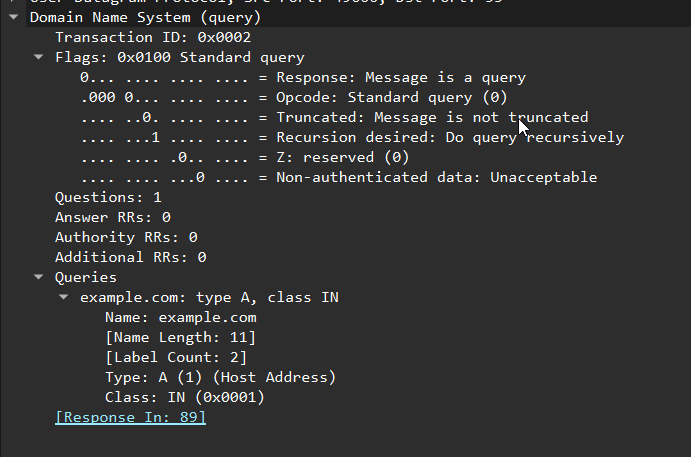
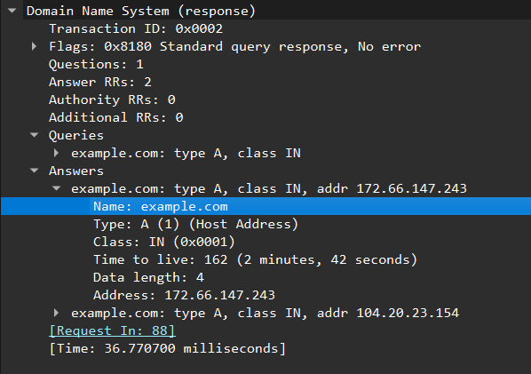
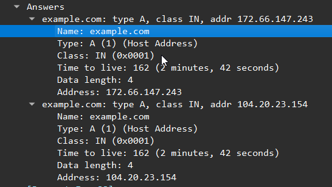

# Lab 02 — DNS Lookup Analysis with Wireshark

## Objective

Capture and analyze a DNS lookup using Wireshark.

The objectives of this lab were to:

- Observe a DNS query and response.
- Identify the DNS server being contacted.
- Examine DNS Transaction IDs.
- Identify A and AAAA DNS queries.
- Identify IPv4 addresses returned by an A record.
- Examine DNS TTL values.
- Understand how Wireshark links DNS queries with their responses.

---

## Environment

| Component | Details |
|---|---|
| Operating System | Windows |
| Packet Analyzer | Wireshark |
| DNS Command | `nslookup` |
| Domain Tested | `example.com` |
| Transport Protocol | UDP |
| Destination Port | `53` |

---

# 1. Generating DNS Traffic

The following command was used to generate DNS traffic:

```powershell
nslookup example.com
```

Wireshark was running during the lookup and the resulting traffic was filtered using:

```text
dns
```

This allowed the DNS packets to be isolated from the rest of the captured traffic.

---

# 2. DNS Query

The first DNS query observed was an A record query for `example.com`.

The client sent the query to its configured DNS resolver.



Important fields observed in the packet:

```text
Transaction ID: 0x0002
Flags: 0x0100 Standard query
Questions: 1
Answer RRs: 0
```

The query contained:

```text
Name: example.com
Type: A (1) (Host Address)
Class: IN
```

### Interpretation

The client was asking the DNS resolver for the IPv4 address associated with `example.com`.

The `Answer RRs: 0` value is expected because this packet is the query. The answer is returned in a separate DNS response.

The packet also contained:

```text
[Response In: 89]
```

indicating that Wireshark associated packet 89 with this query.

---

# 3. DNS Transaction ID

The DNS query contained:

```text
Transaction ID: 0x0002
```

This identifier is used to associate a DNS response with its corresponding query.

The response contained the same Transaction ID:

```text
0x0002
```

Therefore:

```text
Packet 88
DNS Query
Transaction ID: 0x0002
        ↓
Packet 89
DNS Response
Transaction ID: 0x0002
```

This becomes particularly useful when multiple DNS queries are occurring.

---

# 4. DNS Response

The corresponding DNS response was captured in packet 89.



The response contained:

```text
Transaction ID: 0x0002
Flags: 0x8180 Standard query response, No error
Questions: 1
Answer RRs: 2
```

The response returned two A records for `example.com`:

```text
172.66.147.243
104.20.23.154
```

Wireshark also showed:

```text
[Request In: 88]
```

This links the response back to the original DNS query.

---

# 5. DNS A Records

The A records contained IPv4 addresses.



The first record contained:

```text
Name: example.com
Type: A (1) (Host Address)
Class: IN
Time to live: 162
Address: 172.66.147.243
```

The second record contained:

```text
Name: example.com
Type: A (1) (Host Address)
Class: IN
Time to live: 162
Address: 104.20.23.154
```

Therefore, the DNS response provided two IPv4 addresses for the hostname.

---

# 6. DNS TTL

The captured records showed:

```text
Time to live: 162 (2 minutes, 42 seconds)
```

The DNS TTL specifies how long the record can remain cached before it needs to be refreshed.

In this capture:

```text
TTL = 162 seconds
```

This does not represent how long the server or website remains online. It represents the caching lifetime of the DNS record.

---

# 7. A vs AAAA Records

The capture also showed an AAAA query for `example.com`.

DNS address records include:

```text
A
↓
IPv4 address
```

and:

```text
AAAA
↓
IPv6 address
```

The lookup therefore attempted to obtain both IPv4 and IPv6 address information for the hostname.

The A query returned two IPv4 addresses:

```text
172.66.147.243
104.20.23.154
```

---

# 8. DNS Transport

The DNS traffic observed during the lab used:

```text
UDP
Port 53
```

UDP is commonly used for normal DNS queries because it has low overhead and does not require a TCP three-way handshake.

DNS can also use TCP in situations where it is required.

---

# 9. DNS Caching

DNS resolvers can cache DNS records.

For example:

```text
example.com → 172.66.147.243
TTL = 162 seconds
```

While the record remains valid in the cache, the resolver can return the cached result rather than performing another complete lookup.

Conceptually:

```text
Client
   │
   │ DNS query
   ▼
DNS Resolver
   │
   ├── Cache hit → return cached record
   │
   └── Cache miss → perform DNS resolution
```

---

# 10. Observations

The capture demonstrated the following DNS process:

```text
Client
   │
   │ DNS A query
   │ example.com
   ▼
DNS Resolver
   │
   │ DNS response
   │
   ├── 172.66.147.243
   └── 104.20.23.154
   ▼
Client
```

The same Transaction ID was present in both the query and response:

```text
0x0002
```

The returned A records had a TTL of:

```text
162 seconds
```

An AAAA query was also observed, demonstrating that DNS can be used to obtain both IPv4 and IPv6 address information for the same hostname.

---

# 11. Key Takeaways

- DNS translates domain names into IP addresses.
- A computer normally sends DNS queries to its configured DNS resolver.
- Normal DNS lookups commonly use UDP port 53.
- A records contain IPv4 addresses.
- AAAA records contain IPv6 addresses.
- DNS queries contain the question being asked.
- DNS responses contain the resulting records.
- Transaction IDs allow DNS responses to be associated with their queries.
- A hostname can have multiple IP addresses.
- DNS records contain TTL values that control their caching lifetime.
- DNS resolvers can use cached records to avoid unnecessary lookups.
- Wireshark can be used to inspect DNS queries, responses, record types, Transaction IDs, and TTL values.

---

# Conclusion

This lab demonstrated a DNS lookup at the packet level using Wireshark.

The capture showed the client requesting an A record for `example.com`, receiving two IPv4 addresses, and subsequently performing an AAAA lookup. The DNS Transaction ID was used to associate the query with its response, while the TTL indicated how long the returned records could be cached.

This provides a practical understanding of what happens at the network level when a hostname needs to be resolved into an IP address.
