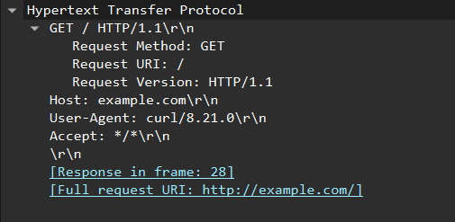
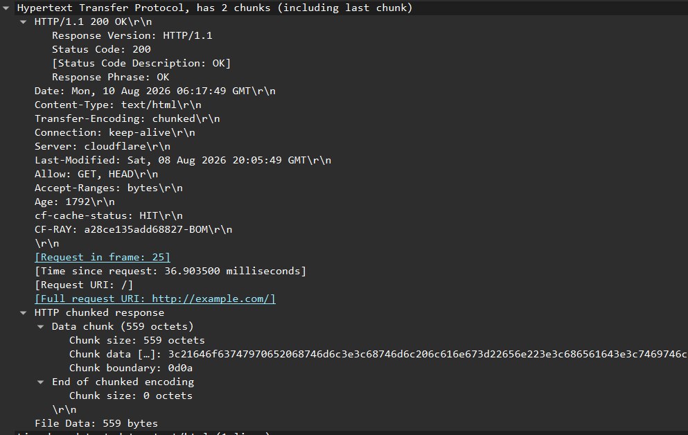

# Lab 03 — HTTP Request and Response Analysis with Wireshark

## Objective

Capture and analyze a plain HTTP request and response using Wireshark.

The objectives of this lab were to:

- Observe an HTTP request over TCP.
- Identify the HTTP request method, path, and version.
- Analyze HTTP request headers.
- Identify the corresponding HTTP response.
- Understand HTTP status codes.
- Analyze response headers.
- Observe the HTML response body in plaintext.
- Observe TCP segmentation and reassembly of HTTP data.
- Understand why plain HTTP traffic can be inspected in Wireshark.

---

## Environment

- Operating System: Windows
- Tool: Wireshark
- Command-line client: `curl.exe`
- Protocol: HTTP
- Destination port: `80`
- Domain tested: `example.com`

---

# 1. Generating HTTP Traffic

A fresh Wireshark capture was started on the active network interface.

The following command was used:

```powershell
curl.exe http://example.com
```

Plain HTTP was intentionally used instead of HTTPS so that the HTTP request and response could be observed in plaintext.

The resulting capture showed the following sequence:

```text
TCP SYN
    ↓
TCP SYN, ACK
    ↓
TCP ACK
    ↓
HTTP GET request
    ↓
HTTP 200 OK response
    ↓
TCP connection termination
```

---

# 2. TCP Connection Establishment

Before the HTTP request was transmitted, a TCP three-way handshake occurred.

The capture showed:

```text
Client → Server
SYN

Server → Client
SYN, ACK

Client → Server
ACK
```

This established the TCP connection before HTTP communication began.

The HTTP traffic was sent to:

```text
Destination Port: 80
```

which is the commonly used port for plain HTTP.

---

# 3. HTTP GET Request

The HTTP request was observed after the TCP handshake.



The request contained:

```http
GET / HTTP/1.1
Host: example.com
User-Agent: curl/8.21.0
Accept: */*
```

### Request Method

```text
GET
```

The `GET` method is generally used to retrieve a resource from the server.

### Request URI

```text
/
```

The `/` represents the root path of the requested host.

### HTTP Version

```text
HTTP/1.1
```

This identifies the HTTP protocol version used for the request.

### Host Header

```text
Host: example.com
```

The Host header identifies the hostname that the request is intended for.

### User-Agent

```text
User-Agent: curl/8.21.0
```

This identifies the client software that generated the request.

In this lab, `curl.exe` generated the request rather than a web browser.

### Accept Header

```text
Accept: */*
```

This indicates that the client is willing to accept any media type in the response.

---

# 4. HTTP Response

Wireshark identified the corresponding HTTP response.



The response began with:

```http
HTTP/1.1 200 OK
```

This can be broken down into:

```text
HTTP/1.1 → HTTP version
200      → Status code
OK       → Status description
```

The `200 OK` status indicates that the request was successfully processed.

Wireshark also identified the original request:

```text
[Request in frame: 25]
```

This allowed the HTTP request and response to be associated with each other.

---

# 5. Response Headers

The HTTP response contained several headers.

Important examples included:

```text
Content-Type: text/html
Transfer-Encoding: chunked
Connection: keep-alive
```

### Content-Type

```text
Content-Type: text/html
```

This indicates that the response body contains HTML.

### Transfer-Encoding

```text
Transfer-Encoding: chunked
```

The response body was transferred using HTTP chunked encoding.

### Connection

```text
Connection: keep-alive
```

This indicates that the connection can remain open for additional communication.

The response also identified:

```text
Server: cloudflare
```

---

# 6. HTTP Response Body

The response contained an HTML body.

Wireshark displayed the response as:

```text
Line-based text data: text/html
```

and the beginning of the body was visible in plaintext:

```html
<!doctype html>
<html lang="en">
<head>
<title>Example Domain</title>
```

This demonstrated that plain HTTP traffic can expose the contents of the HTTP communication to a packet capture.

---

# 7. TCP Segmentation and Reassembly

The HTTP response was carried across multiple TCP segments.

Wireshark showed:

```text
[2 Reassembled TCP Segments]
```

The HTTP data was therefore transmitted through multiple TCP segments and then reassembled by Wireshark.

Conceptually:

```text
HTTP Response
      ↓
TCP Segmentation
      ↓
Multiple TCP Segments
      ↓
Wireshark Reassembly
      ↓
Complete HTTP Response
```

This connects the HTTP layer to the TCP concepts examined in Lab 01.

---

# 8. HTTP Request/Response Flow

The complete communication observed in the capture can be summarized as:

```text
Client
  │
  │ TCP SYN
  ▼
Server
  │
  │ TCP SYN, ACK
  ▼
Client
  │
  │ TCP ACK
  ▼
Established TCP Connection
  │
  │ GET / HTTP/1.1
  │ Host: example.com
  ▼
Server
  │
  │ HTTP/1.1 200 OK
  │ Content-Type: text/html
  │ HTML response
  ▼
Client
```

---

# 9. HTTP and Plaintext Visibility

The HTTP request and response were visible in plaintext because the lab used:

```text
http://example.com
```

rather than:

```text
https://example.com
```

Plain HTTP does not provide TLS encryption.

Therefore, Wireshark was able to display:

```text
GET / HTTP/1.1
Host: example.com
```

as well as the returned HTML.

This differs from HTTPS traffic, where HTTP data is protected by TLS and normally appears as encrypted application data in a packet capture.

---

# 10. Key Observations

The capture demonstrated:

* TCP was established before HTTP communication.
* The HTTP request was sent to port `80`.
* The client used the `GET` method.
* The requested path was `/`.
* The HTTP version was `HTTP/1.1`.
* The Host header identified `example.com`.
* The User-Agent identified `curl/8.21.0`.
* The server returned `HTTP/1.1 200 OK`.
* The response had `Content-Type: text/html`.
* The response used chunked transfer encoding.
* The HTTP response was carried across multiple TCP segments.
* Wireshark reassembled the TCP segments.
* The HTML response was visible in plaintext.

---

# 11. Key Takeaways

1. HTTP operates at the application layer.
2. HTTP commonly uses TCP port 80.
3. A TCP connection is established before HTTP/1.1 communication.
4. `GET` is generally used to retrieve resources.
5. The Host header identifies the intended hostname.
6. The User-Agent identifies the client software.
7. HTTP responses contain status codes and headers.
8. `200 OK` indicates a successful request.
9. HTTP response bodies can be transmitted across multiple TCP segments.
10. Wireshark can reassemble those segments.
11. Plain HTTP traffic can be observed in plaintext.
12. HTTPS uses TLS to protect HTTP communication.

---

# Conclusion

This lab demonstrated a complete HTTP request and response at the packet level.

A TCP connection was established first, after which `curl.exe` sent a `GET / HTTP/1.1` request to `example.com` over port 80. The server responded with `HTTP/1.1 200 OK` and returned an HTML document.

Wireshark allowed the request headers, response headers, and HTML response body to be inspected directly. The capture also demonstrated that the HTTP response could be split across multiple TCP segments and reassembled by Wireshark.

The lab provides the practical foundation for understanding how HTTP traffic can be inspected and manipulated using tools such as Burp Suite.
