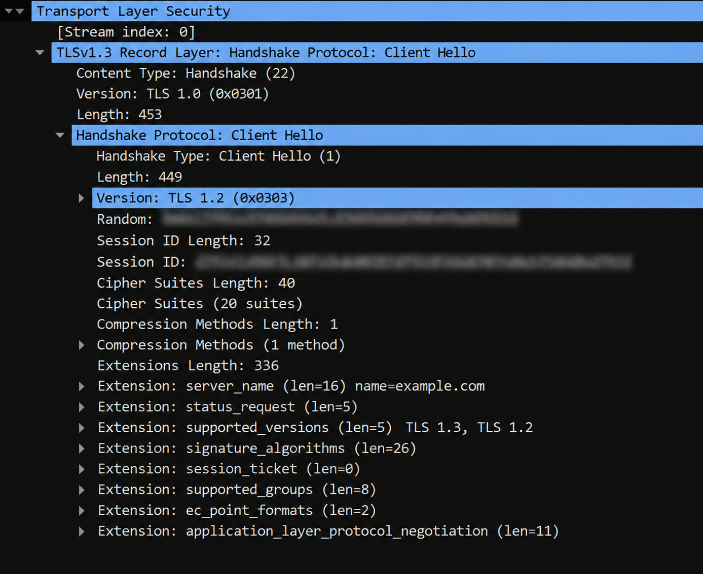
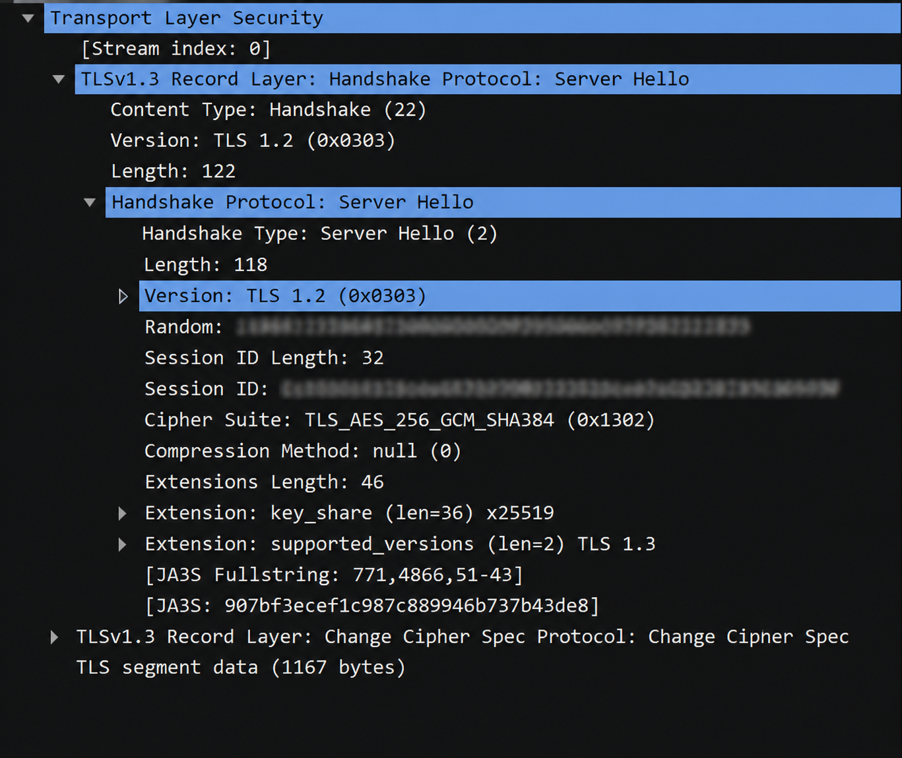

# Lab 04 — HTTPS and TLS Analysis with Wireshark

## Objective

Capture and analyze an HTTPS connection using Wireshark.

The objectives of this lab were to:

- Identify the TLS Client Hello.
- Identify the TLS Server Hello.
- Determine the negotiated TLS version.
- Identify the SNI hostname.
- Identify the cipher suites offered by the client.
- Identify the cipher suite selected by the server.
- Identify the key-exchange group.
- Observe encrypted TLS Application Data.
- Understand why HTTP contents are not visible in plaintext.
- Understand the relationship between TCP, TLS, and HTTP.

---

## Environment

- Operating System: Windows
- Tool: Wireshark
- Protocol: HTTPS
- TLS Version: TLS 1.3
- Destination/Source Port: 443
- Domain: `example.com`

---

# 1. HTTPS Connection Flow

The HTTPS communication can be summarized as:

```text
DNS resolution
      ↓
TCP 3-way handshake
      ↓
TLS Client Hello
      ↓
TLS Server Hello
      ↓
TLS handshake / key establishment
      ↓
Encrypted Application Data
      ↓
HTTP carried inside TLS
```

HTTPS uses TLS to protect HTTP communication.

---

# 2. TLS Client Hello

The first important TLS handshake message observed was the Client Hello.



Wireshark identified the packet as:

```text
TLSv1.3 Record Layer:
Handshake Protocol: Client Hello
```

The packet contained:

```text
Handshake Type: Client Hello (1)
```

This confirms that the message was a TLS Client Hello.

---

## 2.1 Supported TLS Versions

The Client Hello contained:

```text
Extension: supported_versions
TLS 1.3, TLS 1.2
```

This means the client supports both TLS 1.3 and TLS 1.2.

The client therefore provides multiple options so that a compatible TLS version can be selected during negotiation.

The actual negotiated version is determined from the Server Hello.

---

## 2.2 SNI

The Client Hello contained:

```text
Extension: server_name
name=example.com
```

This is the Server Name Indication (SNI).

The SNI tells the server which hostname the TLS connection is intended for.

In this capture:

```text
SNI: example.com
```

SNI identifies the hostname for the TLS connection.

It does not specify the HTTP resource being requested.

---

## 2.3 Cipher Suites

The Client Hello contained:

```text
Cipher Suites Length: 40
Cipher Suites (20 suites)
```

Therefore, the client offered 20 cipher suites.

The purpose of offering multiple cipher suites is to allow the server to select a cryptographic option supported by both sides.

---

# 3. TLS Server Hello

The server responded with a Server Hello.



Wireshark identified:

```text
TLSv1.3 Record Layer:
Handshake Protocol: Server Hello
```

and:

```text
Handshake Type: Server Hello (2)
```

---

## 3.1 Negotiated TLS Version

The Server Hello contained:

```text
Extension: supported_versions
TLS 1.3
```

Therefore, the negotiated TLS version was:

```text
TLS 1.3
```

The Client Hello offered:

```text
TLS 1.3
TLS 1.2
```

and the server selected:

```text
TLS 1.3
```

### Important Wireshark observation

The Server Hello also displayed:

```text
Version: TLS 1.2
```

This field should not be interpreted as the negotiated TLS version.

For modern TLS, the `supported_versions` extension is the important field for determining the negotiated version.

The capture therefore demonstrates:

```text
Client:
TLS 1.3, TLS 1.2

Server:
TLS 1.3

Result:
TLS 1.3
```

---

# 4. Selected Cipher Suite

The Server Hello showed:

```text
Cipher Suite:
TLS_AES_256_GCM_SHA384 (0x1302)
```

This was the cipher suite selected by the server from the options offered by the client.

Therefore:

```text
Client → offers multiple cipher suites
Server → selects TLS_AES_256_GCM_SHA384
```

In TLS 1.3, cipher suites primarily specify the symmetric encryption algorithm and hash. Key exchange parameters are negotiated separately.

---

# 5. Key Exchange

The Server Hello contained:

```text
Extension: key_share (len=36) x25519
```

The key-exchange group observed in the capture was:

```text
x25519
```

X25519 is a key-exchange group used during the TLS 1.3 handshake.

For this lab, the important observation is that key-exchange parameters are used to establish the cryptographic material required for the protected connection.

---

# 6. Compression

The Server Hello showed:

```text
Compression Method: null (0)
```

TLS 1.3 does not use TLS-level compression.

Therefore, no TLS-level compression was negotiated in this connection.

---

# 7. Encrypted Application Data

After the TLS handshake, the capture showed encrypted application data.


Wireshark identified:

```text
TLSv1.3 Record Layer:
Application Data Protocol: Hypertext Transfer Protocol
```

This tells us that the TLS application data is associated with HTTP.

However, the actual HTTP contents were not visible in plaintext.

For example, we could not directly see:

```http
GET / HTTP/1.1
Host: example.com
```

Instead, the packet contained encrypted TLS application data.

---

# 8. Why the HTTP Request Is Not Visible

With plain HTTP:

```text
TCP
 ↓
HTTP
 ↓
Plaintext
```

Wireshark can display:

```http
GET / HTTP/1.1
Host: example.com
```

With HTTPS:

```text
TCP
 ↓
TLS
 ↓
Encrypted HTTP
```

the HTTP data is protected by TLS.

Therefore, Wireshark can identify the TLS/application protocol but cannot normally display the HTTP request contents in plaintext.

This demonstrates the confidentiality provided by TLS.

---

# 9. TCP Segmentation

The encrypted application data was carried across multiple TCP segments.

Wireshark showed:

```text
[4 Reassembled TCP Segments (4214 bytes)]

#13 (1167 bytes)
#14 (1300 bytes)
#15 (1300 bytes)
#16 (447 bytes)
```

The total reassembled TCP data was:

```text
4214 bytes
```

This demonstrates that TLS application data can be transported across multiple TCP segments.

The process is:

```text
TLS Application Data
        ↓
TCP segmentation
        ↓
Multiple TCP segments
        ↓
Wireshark reassembly
        ↓
TLS encrypted data
```

TCP reassembly does not decrypt the TLS contents.

---

# 10. TCP Information

The Application Data packet showed:

```text
Source Port: 443
```

Port `443` is the commonly used port for HTTPS.

The packet also showed:

```text
TCP Segment Len: 447
```

and:

```text
Flags: PSH, ACK
```

The TCP layer was responsible for transporting the TLS data reliably.

---

# 11. TLS Security Properties

The capture demonstrates the role of TLS in protecting HTTP communication.

### Confidentiality

The HTTP data is encrypted, preventing normal passive packet inspection from reading the request and response contents.

### Integrity

TLS protects against undetected modification of protected data.

### Authentication

TLS helps verify the identity of the server.

Therefore:

```text
TLS
├── Confidentiality
├── Integrity
└── Authentication
```

while TCP provides:

```text
TCP
└── Reliable transport
```

---

# 12. Client Hello → Server Hello

The complete negotiation observed in the capture was:

```text
CLIENT HELLO

SNI:
example.com

Supported versions:
TLS 1.3
TLS 1.2

Cipher suites:
20 offered
        │
        ▼
SERVER HELLO

Selected version:
TLS 1.3

Selected cipher suite:
TLS_AES_256_GCM_SHA384

Key exchange group:
x25519
```

This demonstrates how the client and server negotiate the parameters required for the TLS connection.

---

# 13. HTTP vs HTTPS Comparison

The previous HTTP lab showed:

```text
TCP
 ↓
HTTP
 ↓
GET / HTTP/1.1
Host: example.com
 ↓
Plaintext HTML response
```

The HTTPS lab showed:

```text
TCP
 ↓
TLS handshake
 ↓
TLS 1.3
 ↓
Encrypted Application Data
 ↓
HTTP
```

The major difference is that TLS protects the HTTP communication.

---

# 14. Key Observations

The capture demonstrated:

* A TLS Client Hello was sent by the client.
* The client supported TLS 1.3 and TLS 1.2.
* The Client Hello contained SNI for `example.com`.
* The client offered 20 cipher suites.
* The server responded with a Server Hello.
* TLS 1.3 was selected.
* `TLS_AES_256_GCM_SHA384` was selected.
* `x25519` was observed as the key-exchange group.
* TLS-level compression was not used.
* The application data was identified as HTTP.
* The HTTP contents were encrypted.
* The HTTPS traffic used source port `443`.
* The encrypted application data was carried across multiple TCP segments.
* Wireshark reassembled the TCP segments but could not normally display the HTTP contents in plaintext.

---

# 15. Key Takeaways

1. HTTPS is HTTP protected by TLS.
2. HTTPS commonly uses TCP port `443`.
3. TCP establishes the transport connection before TLS.
4. The Client Hello contains supported TLS versions, cipher suites, SNI, and other extensions.
5. The Server Hello contains the server's selected parameters.
6. The captured connection negotiated TLS 1.3.
7. The selected cipher suite was `TLS_AES_256_GCM_SHA384`.
8. The key-exchange group observed was `x25519`.
9. SNI identified `example.com`.
10. TLS protects HTTP data from normal passive inspection.
11. Wireshark can identify protocol information without being able to read encrypted HTTP contents.
12. TLS application data can be split across multiple TCP segments.
13. TCP reassembly does not decrypt TLS data.

---

# Conclusion

This lab demonstrated HTTPS communication and the TLS 1.3 handshake at the packet level.

The Client Hello showed that the client supported TLS 1.3 and TLS 1.2, provided SNI for `example.com`, and offered multiple cipher suites. The Server Hello selected TLS 1.3, `TLS_AES_256_GCM_SHA384`, and the `x25519` key-exchange group.

After the handshake, Wireshark identified encrypted Application Data associated with HTTP. Unlike the plain HTTP lab, the HTTP request and response contents were not visible in plaintext.

This demonstrates the practical difference between HTTP and HTTPS and provides the foundation for understanding how HTTPS traffic can be handled by tools such as Burp Suite during authorized security testing.
